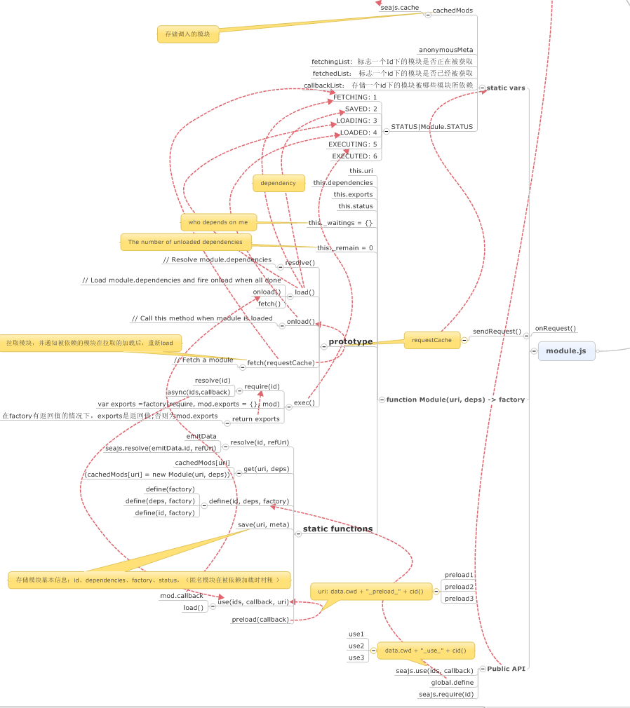

#  sea.js浅析(上) #
---

分析是基于这段时间，看sea.js源码，对其cmd模块加载机制的理解而成的。seajs里面有很多不错的程序设计思路，在此整理学习。**[seajs2.2.0源码](https://github.com/seajs/examples/blob/master/sea-modules/seajs/seajs/2.2.0/sea-debug.js)**

在seajs的github仓库中，存放着如上图展示的seajs的两大类模块，一类是工具模块。以util开头的：

1. 关于公用功能，例如数据类型判断，加载模块id生成的**util-lang模块**
2. 关于自定义事件处理的**util-events模块**
3. 关于路径解析获得模块路径、调用当前路径的**util-path模块**
4. 关于请求js、css文件，加载资源的**util-request模块**
5. 通过一个大的正则来解析依赖的**util-deps模块**
6. 虽然**config模块**没有以util开头，实际上还是为主模块服务的，依然可以作为工具模块看待，主要处理对使用sea.js的一些用户配置。

除了工具模块之外，seajs中就是实现模块机制的**module模块**

工具模块与核心的module模块之间相互依赖，形成seajs加载器

这篇文章，我们来关注下**工具模块**

##util-lang##

util-lang在代码中，有两个主要的功能：

1. 类型判断
2. 生成加载模块id

类型判断的代码比较平常，主要就是利用Object.prototype.toString.call() 或者是{}.toString.call()这种方式来写了一个工厂函数来判断数据类型，这一点，玉伯在[sea.js源码解析（三）](https://github.com/lifesinger/lifesinger.github.com/issues/175 "sea.js源码解析（三）")中讲了这个用法的历史来源。

第二个功能就是利用一个

	var _cid = 0
	function cid() {
	  return _cid++
	}

这个函数来做一个使用模块id的生成，这一点会在后面module模块讲解中提到。

##util-events##

utl-event模块将用户的自定义事件的数据绑定到seajs.data这个同时也是作为seajs数据配置数据对象上，实现对事件的管理。其中包含3个常用方法：on、off、emit

以 事件名key -> 相应函数数组 callback Array 的方式来进行对事件信息的保存，在seajs中对外暴露的方法最后都会返回一个seajs对象满足链式调用。on方法则是往对应事件的处理函数数组中推函数
	var events = data.events = {}

	seajs.on = function(name, callback) {
	  var list = events[name] || (events[name] = [])
	  list.push(callback)
	  return seajs
	}
代码上主要是判断是否已经绑定过该事件（如果已经绑定，则说明已经有对应函数名属性下的数组），有的话，直接推入处理函数到对应数组下，没有的话则按照事件名新建数组到seajs.events上 

off方法则是找到对应事件名，删除这个属性里面的对应处理函数，如果不不传删除的对应处理函数，则默认删除该事件下的所用处理函数，如果不传参数，则默认删除所有事件

	seajs.off = function(name, callback) {
	  // Remove *all* events
	  if (!(name || callback)) {
	    events = data.events = {}
	    return seajs
	  }
	
	  var list = events[name]
	  if (list) {
	    if (callback) {
	      for (var i = list.length - 1; i >= 0; i--) {
	        if (list[i] === callback) {
	          list.splice(i, 1)
	        }
	      }
	    }
	    else {
	      delete events[name]
	    }
	  }
	
	  return seajs
	}
代码实现上，实际就是对events这个与seajs.data建立引用的事件处理对象进行事件的查找和删除，分为

1. name、callback 两个参数都不传 -> 删除所有绑定在seajs上的事件
2. 传递name一个参数 -> 直接删除seajs.events下的对应事件属性
3. 传递name、callback,则删除对应以name为名下的以callback为名的处理函数，函数引用会对应匹配，需要传递绑定时传的callback

emit则是抽出对应事件名属性下的函数进行依次调用，在emit（event，[arguments]）后面跟的参数会出入到处理函数中

	var emit = seajs.emit = function(name) {
	  var list = events[name], fn
	
	  if (list) {
	    // Copy callback lists to prevent modification
	    list = list.slice()
	    var args = Array.prototype.slice.call(arguments, 1);
	    // Execute event callbacks
	    while ((fn = list.shift())) {
	      fn.apply(null, args);
	    }
	  }
	
	  return seajs
	}

代码上主要是获得传递的除事件名外的参数，通过while循环的方式，将获得的参数通过apply的形式调用。

##util-path##

模块加载需要处理资源的依赖加载、模块的依赖执行，而依赖加载中，所有的模块id路径处理都需要通过util-path这个模块，可见这模块的重要性。

模块进入首先是4个正则表达式

	var DIRNAME_RE = /[^?#]*\//
	
	var DOT_RE = /\/\.\//g
	var DOUBLE_DOT_RE = /\/[^/]+\/\.\.\//
	var DOUBLE_SLASH_RE = /([^:/])\/\//g

`DIRNAME_RE`的作用是获得当前文件的文件夹路径，这个表达式被封装在了`dirname()`这个方法里面使用，在seajs中，通过`dirname()`函数来获得当前页面的文件夹路径`cwd`、模块加载的初始化位置`loaderDir`,这两个参数会在调用config模块的时候统一赋值到`data.dir`、`data.cwd`上。在源代码实现中与之相关的有一处需要注意：

	// Recommend to add `seajsnode` id for the `sea.js` script element
	var loaderScript = doc.getElementById("seajsnode") ||
	    scripts[scripts.length - 1]

这里的`loaderScript`的作用关系到`loaderDir`,而`loaderDir`对模块的起始加载位置（在后面的`addBase()`函数中会提到)有很大作用。而上面的代码告诉我们，如果要保证路径正确（也就是`loaderScript`正确被模块取到）那么seajs存在在页面上的位置必须是：

1. id为seajsnode的script标签
2. seajs为最后一个script引用标签

这里还可以看出，模块的初始路径实际上是按照seajs的路径为基准的。

`DOT_RE`、`DOUBLE_DOT_RE`、`DOUBLE_SLASH_RE`这三个正则主要是运用在`realpath()`这个函数中：

	// Canonicalize a path
	// realpath("http://test.com/a//./b/../c") ==> "http://test.com/a/c"
	function realpath(path) {
	  // /a/b/./c/./d ==> /a/b/c/d
	  path = path.replace(DOT_RE, "/")
	
	  // a/b/c/../../d  ==>  a/b/../d  ==>  a/d
	  while (path.match(DOUBLE_DOT_RE)) {
	    path = path.replace(DOUBLE_DOT_RE, "/")
	  }
	
	  // a//b/c  ==>  a/b/c
	  path = path.replace(DOUBLE_SLASH_RE, "$1/")
	
	  return path
	}

从源码上我们可以看出来，首先去替换`./`这种相对路径，例如b/./c,这里的`./`实际上就是对应的`b`,那么这里`/./`就会被替换成`b/`。同样，`b/c/../d`，这里的`/../`对应的就是`b`，那么这里就会被替换成`b/`,这里的正则是`/\/[^/]+\/\.\.\//`,相当于是匹配`目标文件夹位置/被跨过的文件夹路径/../`，那么这个匹配内容会被`/`代替，这样就会实现把路径替换到基于`../`后面文件位置的上一层位置。

路径转换的最后对路径再做了一层优化，讲路径中错误的`//`纠正为`/`。

`realpath()`函数后面紧接着是`normalize()`函数，这个函数主要是去处理路径最后的资源格式符，判断处理这个路径下的文件是否为js、css，并且返回带格式符的路径，便于加载（通过`request()`函数实现）。

大家可能会发现，这里实际上并没有对`config`这个对象里面的配置进行加载处理，恩，下面会有4个函数做这个事情。

1. `parseAlias(id)`对应config里面的`alias`
2. `parsePaths(id)`对应config里面的`paths`
3. `parseVars(id)`对应config里面的`vars`
4. `parseMap(id)`对应config里面的`map`

我们来看看代码上的实现

**parseAlias:**

	function parseAlias(id) {
	  var alias = data.alias
	  return alias && isString(alias[id]) ? alias[id] : id
	}

**首先需要提到的是`seajs.config()`配置的参数都会保存到`seajs.data`上，这里的`data`是对`seajs.data`的引用。**

**这四个函数的调用顺序是`parseAlias(id)`->`parsePaths(id)`->`parseVars(id)`->`parseMap(id)`**

可以看出对alias做的事情不多，这里会去查找调用的模块名是不是有在alias有配置，有的话，则返回对应的配置信息，没有的话，则返回原有的id

**parsePaths:**

	var PATHS_RE = /^([^/:]+)(\/.+)$/
	function parsePaths(id) {
	  var paths = data.paths
	  var m
	
	  if (paths && (m = id.match(PATHS_RE)) && isString(paths[m[1]])) {
	    id = paths[m[1]] + m[2]
	  }
	
	  return id
	}

很多刚接触seajs的人可能会对path和alias产生疑惑和混淆，看下具体实现就真相大白了。

这里的`parsePath`会有一个对应使用的正则`/^([^/:]+)(\/.+)$/`,其实这个正则就是去划分两个部分，路径中第一个`/`之前的文件夹路径为**第一部分**，`/`之后的路径为**第二部分**。

然后如果有paths配置的话，进入判断逻辑`(m = id.match(PATHS_RE)) && isString(paths[m[1]])`，这里主要会去匹配**第一部分**，如果在经过`parseAlias()`处理之后的路径中，第一部分在path里面存在着配置，那么就会将第一部分进行替换。

其实`path`、`alias`按我的理解，`alias`是对在`path`的作用上再做了一层简化配置，`path`是对路径基本的简化替换配置。在`alias`中，我们需要去争对`path`中对于**第一部分**去配置，起始文件夹的位置对应`path`中的配置属性。结合`path`和`alias`去配置，才能保证路径的正确。

**parseVars**

这里的var，相当于是建立了一个可以在路径配置中可以赋值变化的变量。

首先`parseVars`函数会用到一个正则`/{([^{]+)}/g`,这个正则会匹配`{}`里面的内容，然后在路径中替换通过`{}`设置的变量。

**parseMap**

这里的Map有点类似于vars,但是不同的是在后面的`id2Url()`提到，vars的配置是以对象的方式来配置属性，是一个属性对应一个字符串，而map可以实现函数的调用替换，加入传入一个配置函数，实际上路径会通过函数加工后返回来实现配置，并且除此之外，map的配置是一个属性对应一个两个元素的数组，规则是路径中存在的数组的第一个元素会被替换成数组中的第二个元素

  	ret = isFunction(rule) ?
          (rule(uri) || uri) :
          uri.replace(rule[0], rule[1])

上面是map函数中的一段代码，可以看出map的配置方式一种是函数、一种是数组

**addBase**

addBase函数实际上是对处理路径id到一定阶段后的分流，判断路径类型，得出一个阶段性的路径结果（这个步骤结束就只剩最后一步map的替换了）

	var ABSOLUTE_RE = /^\/\/.|:\//
	var ROOT_DIR_RE = /^.*?\/\/.*?\//

	function addBase(id, refUri) {
	  var ret
	  var first = id.charAt(0)
	
	  // Absolute
	  if (ABSOLUTE_RE.test(id)) {
	    ret = id
	  }
	  // Relative
	  else if (first === ".") {
	    ret = realpath((refUri ? dirname(refUri) : data.cwd) + id)
	  }
	  // Root
	  else if (first === "/") {
	    var m = data.cwd.match(ROOT_DIR_RE)
	    ret = m ? m[0] + id.substring(1) : id
	  }
	  // Top-level
	  else {
	    ret = data.base + id
	  }
	
	  // Add default protocol when uri begins with "//"
	  if (ret.indexOf("//") === 0) {
	    ret = location.protocol + ret
	  }*
	
	  return ret
	}

从源代码上可以看到，在`addBase()`中，有四条道路：绝对路径、相对路径、根路径、顶层路径。

首先是对于**绝对路径**，对应的匹配正则是`/^\/\/.|:\//`，对应去检测路径中是否存在"//xxx"或者":/"，如果存在，则说明为绝对路径，那么路径id就不会再做处理，直接返回

其次是**相对路径**，相对路径有很明显的一点是，以`./`开头，那么在代码实现上，是去检测路径字符串中的第一个字符是否为`.`。那么在相对路径的情况下，我们要绝对路径，就首先要知道当前的路径是什么，那么这里addBase提供了一个参数`refUri`来作为当前路径的一个考证。在`(refUri ? dirname(refUri) : data.cwd`这个表达式中，会去检测是否传入`refUri`参数，如果传入的话，就以这个参数为基础加上当前调用模块的id，如果未传入的话，则以之前获得的cwd路径为基准，并且经过realpath()把相对路径中的例如`../`或者`../`都处理掉后得出结果路径

然后如果是**根路径**，也就是路径第一个字符是`/`的情况,这里会使用到一个正则`/^.*?\/\/.*?\//`，这里回去检测目前的seajs工作路径`cwd`,如果当前的工作路径中存在类似于path//to/的结构，比如像http://www.taobao.com/test.html  ，match的结果就是http://www.taobao.com/  这个路径。从源码上来看，在这种情况下来看，就是在工作路径的基础加上根路径，相当于是以工作路径为根路径，否则的话，则是单独id为路径。

最后一种情况比较特殊[toplevel](http://blog.csdn.net/kyfxbl/article/details/12996017)，**top-level**,类似于path/to/file这样的路径，从源码我们也可以看得出，计算路径是直接以base为基础。而data.base，主要就是通过前面提到的loaderDir来获得（在config模块中）。

	data.base = (loaderDir.match(BASE_RE) || ["", loaderDir])[1]

addbase在最后还会去检测是否在路径中包含协议部分，如果没有的话，会去在结果路径中加上`location.protocol`.

在util-path模块中最后通过一个id2Uri的函数把前面这几个路径解析函数组装起来。

	function id2Uri(id, refUri) {
	  if (!id) return ""
	
	  id = parseAlias(id)
	  id = parsePaths(id)
	  id = parseVars(id)
	  id = normalize(id)
	
	  var uri = addBase(id, refUri)
	  uri = parseMap(uri)
	
	  return uri
	}

##util-request##

作为一个loader在管理各个js模块之间的依赖之前，首先需要将js物理文件加载进来，那么seajs是怎么做的呢？seajs在发布的时候提到解决一个页面中引入较多js文件而可能引起加载顺序错乱、难以管理的问题，那么又是怎么解决的呢？request模块负责seajs的文件加载，来看下具体实现吧。

request模块首先准备了两个变量`head`、`baseElement`.

	var head = doc.head || doc.getElementsByTagName("head")[0] || doc.documentElement
	var baseElement = head.getElementsByTagName("base")[0]

这里的doc指的是前面定义的document.取head元素的方式中`doc.head`ie在9开始支持。`doc.documentElement`这个考虑应该是在页面中不存在head标签时，则选择插入到body标签中。

模块中的核心函数是`request()`

	function request(url, callback, charset) {
	  var isCSS = IS_CSS_RE.test(url)
	  var node = doc.createElement(isCSS ? "link" : "script")
	
	  if (charset) {
	    var cs = isFunction(charset) ? charset(url) : charset
	    if (cs) {
	      node.charset = cs
	    }
	  }
	
	  addOnload(node, callback, isCSS, url)
	
	  if (isCSS) {
	    node.rel = "stylesheet"
	    node.href = url
	  }
	  else {
	    node.async = true
	    node.src = url
	  }
	
	  // For some cache cases in IE 6-8, the script executes IMMEDIATELY after
	  // the end of the insert execution, so use `currentlyAddingScript` to
	  // hold current node, for deriving url in `define` call
	  currentlyAddingScript = node
	
	  // ref: #185 & http://dev.jquery.com/ticket/2709
	  baseElement ?
	      head.insertBefore(node, baseElement) :
	      head.appendChild(node)
	  
	  currentlyAddingScript = null
	}

函数首先会判断是否是css，这里会用到一个正则`var IS_CSS_RE = /\.css(?:\?|$)/i`，检测路径是否符合.css?xxx或者直接是以.css结尾。函数在加上编码之后，会调用`addOnload()`，这里后面会提到。随后，会匹配上针对css或者是js相应的属性。在函数最后会有一个兼容ie6-8的处理，主要是针对定义`define`以及模块url的处理，这里会在后面的Module模块里提到。

在插入节点之后，我们来看下为插入加载完成后做的处理，也就是`addOnload`做了什么。

	function addOnload(node, callback, isCSS, url) {
	  var supportOnload = "onload" in node
	
	  // for Old WebKit and Old Firefox
	  if (isCSS && (isOldWebKit || !supportOnload)) {
	    setTimeout(function() {
	      pollCss(node, callback)
	    }, 1) // Begin after node insertion
	    return
	  }
	
	  if (supportOnload) {
	    node.onload = onload
	    node.onerror = function() {
	      emit("error", { uri: url, node: node })
	      onload()
	    }
	  }
	  else {
	    node.onreadystatechange = function() {
	      if (/loaded|complete/.test(node.readyState)) {
	        onload()
	      }
	    }
	  }
	
	  function onload() {
	    // Ensure only run once and handle memory leak in IE
	    node.onload = node.onerror = node.onreadystatechange = null
	
	    // Remove the script to reduce memory leak
	    if (!isCSS && !data.debug) {
	      head.removeChild(node)
	    }
	
	    // Dereference the node
	    node = null
	
	    callback()
	  }
	}

在函数调用之前会有几个判断

1. 对节点onload事件的判断
2. 对css的判断
3. 对老版本webkit的判断

首先是检测在当前浏览器环境下，加载的css、js是否支持onload事件，在源码中有这样一段

	// `onload` event is not supported in WebKit < 535.23 and Firefox < 9.0
	// ref:
	//  - https://bugs.webkit.org/show_activity.cgi?id=38995
	//  - https://bugzilla.mozilla.org/show_bug.cgi?id=185236
	//  - https://developer.mozilla.org/en/HTML/Element/link#Stylesheet_load_events
	var isOldWebKit = +navigator.userAgent
	    .replace(/.*(?:AppleWebKit|AndroidWebKit)\/(\d+).*/, "$1") < 536

seajs会通过匹配webkit版本检测，针对老版本是不支持onload事件的，但其实这里有个**疑问**，通过In操作符检测事件属性判断是否支持onload事件这种方法应该可以在老版本的webkit内核浏览器中得到结果，那么实际上应该可以去掉这个检测，都应该可以通过检测属性的方式判断。

函数接下来是对节点为css且节点在当前浏览器环境下不支持onload事件的情况进行处理，这里会提到一个pollCss()递归函数来检测load状态，后面会提到。接下来就可以把情况划分为支持onload事件的css、js和不支持onload事件的js。

针对前者，函数会把内部方法onload()绑定到节点的onload事件上。这里的onload方法可以看出，首先将事件绑定去除，如果节点为js的话，去除js节点，然后调用传入的callback方法。

而针对后者，不支持onload事件的js，会去绑定onreadystatechange事件，去监听节点的加载状态，通过`node.readyState`来判断是否加载完成，然后同样调用onload方法。

而pollCss()作为处理不支持onload的css，是这样做的：

	function pollCss(node, callback) {
	  var sheet = node.sheet
	  var isLoaded
	
	  // for WebKit < 536
	  if (isOldWebKit) {
	    if (sheet) {
	      isLoaded = true
	    }
	  }
	  // for Firefox < 9.0
	  else if (sheet) {
	    try {
	      if (sheet.cssRules) {
	        isLoaded = true
	      }
	    } catch (ex) {
	      // The value of `ex.name` is changed from "NS_ERROR_DOM_SECURITY_ERR"
	      // to "SecurityError" since Firefox 13.0. But Firefox is less than 9.0
	      // in here, So it is ok to just rely on "NS_ERROR_DOM_SECURITY_ERR"
	      if (ex.name === "NS_ERROR_DOM_SECURITY_ERR") {
	        isLoaded = true
	      }
	    }
	  }
	
	  setTimeout(function() {
	    if (isLoaded) {
	      // Place callback here to give time for style rendering
	      callback()
	    }
	    else {
	      pollCss(node, callback)
	    }
	  }, 20)
	}

函数大框架可以看到在最后用一个setTimeout里的判断来实现函数递归判断。这里分为两个情况，一个针对webkit<536,直接去检测`node.sheet`属性，如果存在，则说明css加载完成。其次是针对ff<9.0时，不断去try sheet.cssRules，如果存在则说明css加载完成，这里在catch中还会去对抛出的ex.name做特殊判断，在timeout中会去根据isLoaded这个变量来实现如果加载完成则调用传入的callback（）函数，否则再次调用pollCss()本身，频率是20ms执行一次。

通过上面3个函数可以看出，seajs在加载节点是，为了实现页面上js的管理，其中一部分是利用append加载到页面上实现请求js脚本，在onload的时候删除，这样在页面代码上，其实就看不到实际加载的js模块文件，另一部分是结合module模块来实现对这些js模块的逻辑依赖。seajs的口号是a web loader，可以从源码上看出实际上也实现了对css的加载。

##config.js##

seajs的配置管理通过config这个模块进行管理。

模块首先是对`base`的处理

	var BASE_RE = /^(.+?\/)(\?\?)?(seajs\/)+/
	
	// The root path to use for id2uri parsing
	// If loaderUri is `http://test.com/libs/seajs/[??][seajs/1.2.3/]sea.js`, the
	// baseUri should be `http://test.com/libs/`
	data.base = (loaderDir.match(BASE_RE) || ["", loaderDir])[1]

这里代码注释已经标注得比较明白了，会拿loaderDir来匹配BASE_RE,得到一个seajs默认的base.这里会去匹配`loaderDir`，其中`??`代表的被combo的seajs资源，会从`loaderDir`拿到seajs的文件夹路径，如果不符合匹配的话则以原始loadDir为base.

这里探讨一下loaderDir的获取过程

	var cwd = dirname(doc.URL)
	
	var DIRNAME_RE = /[^?#]*\//
	// Extract the directory portion of a path
	// dirname("a/b/c.js?t=123#xx/zz") ==> "a/b/"
	// ref: http://jsperf.com/regex-vs-split/2
	function dirname(path) {
	  return path.match(DIRNAME_RE)[0]
	}

	// Recommend to add `seajsnode` id for the `sea.js` script element
	var loaderScript = doc.getElementById("seajsnode") ||
    scripts[scripts.length - 1]

	// When `sea.js` is inline, set loaderDir to current working directory
	var loaderDir = dirname(getScriptAbsoluteSrc(loaderScript) || cwd)
	
	function getScriptAbsoluteSrc(node) {
	  return node.hasAttribute ? // non-IE6/7
	      node.src :
	    // see http://msdn.microsoft.com/en-us/library/ms536429(VS.85).aspx
	      node.getAttribute("src", 4)
	}

loaderDir的获取路径我们可以从源码上可以看到 
			
	             getScriptAbsoluteSrc() || cwd
					        dirname()
	loaderScript              ->                    loaderDir

首先是通过找到seajs的引用节点，在`getScriptAbsoluteSrc()`方法中，判断是否ie6-7,分别通过`src`属性和`getAttribute（）`方法拿到引用节点的路径，这里针对ie在方法上传递了第二个参数，在注释链接中有相应解释。如果获取失败的话，则会去选择`cwd`,而`cwd`是通过dirname去匹配页面的文件夹路径。

则我们我可以预见，如果在通过seajs引用路径获得loaderDir的话，则是以引用seajs的路径为基准，否则以当前页面的路径为基准。

接下来是一些参数的初始化，例如`data.dir` 、`data.cwd`、`data.preload`，这里可以提一下的是,preload是通过一个匿名函数将plugin的参数先进行加载。

config模块最后就是暴露给用户的config函数了

	seajs.config = function(configData) {
	
	  for (var key in configData) {
	    var curr = configData[key]
	    var prev = data[key]
	
	    // Merge object config such as alias, vars
	    if (prev && isObject(prev)) {
	      for (var k in curr) {
	        prev[k] = curr[k]
	      }
	    }
	    else {
	      // Concat array config such as map, preload
	      if (isArray(prev)) {
	        curr = prev.concat(curr)
	      }
	      // Make sure that `data.base` is an absolute path
	      else if (key === "base") {
	        // Make sure end with "/"
	        if (curr.slice(-1) !== "/") {
	          curr += "/"
	        }
	        curr = addBase(curr)
	      }
	
	      // Set config
	      data[key] = curr
	    }
	  }
	
	  emit("config", configData)
	  return seajs
	}

函数这里会比较config之前初始化的值，和现在用户配置的值。并进行相应的替换。

1. 如果是配置项是对象，那么更换对象中的属性;
2. 如果是是数组，那么会通过concat添加上用户的配置值;
3. 如果配置的值是base,则会把配置的base值，经过addBase()函数得到绝对属性。

浅析**seajs上**大致把seajs中除util-deps的“辅助”模块大致简单讲解了一遍，**seajs下**将会结合这篇文章中提到的模块来讲解seajs的核心模块

