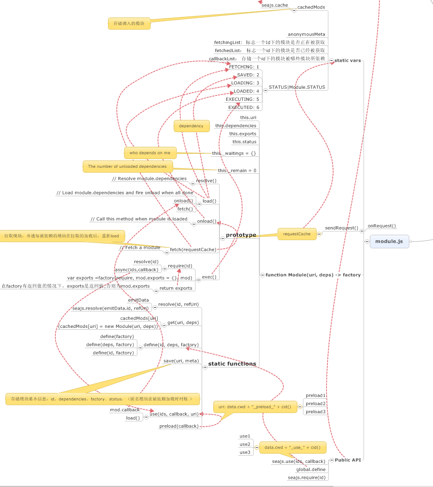

#  sea.js浅析(下) #

这篇文章主要是记录seajs核心模块module.js。

从脑图可以简单的看到:
1. module模块中包含如`cacheMods`、`anonymouseMeta`、`fetchingList`等公共变量来调配seajs模块管理的信息。
2. 对于模块加载、依赖状态，有一个`status`枚举来实现管理
3. 通过`resolve()`、`load()`、`onload()`、`fetch()`等函数并且依赖前面提到的辅助模块来实现模块之间的加载、依赖逻辑。

下面我们进入源码来一探究竟。

和大多数框架一样，进入模块首先是全局变量的设置。

	var cachedMods = seajs.cache = {}
	var anonymousMeta
	
	var fetchingList = {}
	var fetchedList = {}
	var callbackList = {}
	
	var STATUS = Module.STATUS = {
	  // 1 - The `module.uri` is being fetched
	  FETCHING: 1,
	  // 2 - The meta data has been saved to cachedMods
	  SAVED: 2,
	  // 3 - The `module.dependencies` are being loaded
	  LOADING: 3,
	  // 4 - The module are ready to execute
	  LOADED: 4,
	  // 5 - The module is being executed
	  EXECUTING: 5,
	  // 6 - The `module.exports` is available
	  EXECUTED: 6
	}

先大致介绍下这里的全局变量：

1. `cachedMods`,在seajs中，所有加载的模块都会通过`Module()`构造并`push`到`cahedMods`中进行管理。
2. `anonymouseMeta`,这个变量的看英文的意思是“匿名元数据”，其实作用是在定义模块的时候，如果是匿名模块的话，会对还未加载的匿名模块做信息缓存。
3. `fechingList`、`fechedList`,这两个变量的作用是seajs在加载依赖模块时，对模块所正在拉取的依赖和完成拉取的依赖的管理
4. `callbackList`,这个变量与`fechingList`、`fechedList`想关联，是对加载的依赖完成之后，会去调用加载完成依赖的模块的回调函数，这里可以实现对多层依赖、相互依赖的管理。
5. `STATUS`，从可枚举的字段值可以看出，这个变量目的是为实现对模块各个状态的标志维护。

对于物理的js文件作为模块，seajs通过一个`Module()`构造器函数来初始化信息

	function Module(uri, deps) {
	  this.uri = uri
	  this.dependencies = deps || []
	  this.exports = null
	  this.status = 0
	
	  // Who depends on me
	  this._waitings = {}
	
	  // The number of unloaded dependencies
	  this._remain = 0
	}

可以从构造器函数看出，生成的每一个模块实例，包含着模块seajs对模块加载管理的基本信息:

1. `this.uri`,模块对应文件的物理路径
2. `this.dependencies`,模块需要加载的依赖模块
3. `this.exports`,和node.js类似，这个是模块暴露api的对象
4. `this.status`, 模块状态
5. `this._watings`,这里注释写得很明白，`_watings`管理的是依赖该模块的模块
6. `this.remian`,剩余的未加载的依赖模块数量

信息骨架有了，剩下的就是通过这些信息辅助，实现模块之间依赖管理的逻辑了。

首先是`resolve()`函数

	// Resolve module.dependencies
	Module.prototype.resolve = function() {
	  var mod = this
	  var ids = mod.dependencies
	  var uris = []
	
	  for (var i = 0, len = ids.length; i < len; i++) {
	    uris[i] = Module.resolve(ids[i], mod.uri)
	  }
	  return uris
	}

这个函数可以看出，主要的作用是通过调用Module.resolve函数去拿到依赖模块的物理路径数组并返回。

这里我们找到`Module.resolve()`函数来看看：

	// Resolve id to uri
	Module.resolve = function(id, refUri) {
	  // Emit `resolve` event for plugins such as text plugin
	  var emitData = { id: id, refUri: refUri }
	  emit("resolve", emitData)
	
	  return emitData.uri || seajs.resolve(emitData.id, refUri)
	}

这里我们先取出触发插件对id的改变，可以看到，主要是调用`seajs.resolve()`函数,而`seajs.resolve()`函数前面提到，主要是就是对`id`到`uri`的解析，也就是`id2Uri()`函数.

接下来就是`load()`函数:

	// Resolve module.dependencies
	Module.prototype.resolve = function() {
	  var mod = this
	  var ids = mod.dependencies
	  var uris = []
	
	  for (var i = 0, len = ids.length; i < len; i++) {
	    uris[i] = Module.resolve(ids[i], mod.uri)
	  }
	  return uris
	}
	
	// Load module.dependencies and fire onload when all done
	Module.prototype.load = function() {
	  var mod = this
	
	  // If the module is being loaded, just wait it onload call
	  if (mod.status >= STATUS.LOADING) {
	    return
	  }
	
	  mod.status = STATUS.LOADING
	
	  // Emit `load` event for plugins such as combo plugin
	  var uris = mod.resolve()
	  emit("load", uris, mod)
	
	  var len = mod._remain = uris.length
	  var m
	
	  // Initialize modules and register waitings
	  for (var i = 0; i < len; i++) {
	    m = Module.get(uris[i])
	
	    if (m.status < STATUS.LOADED) {
	      // Maybe duplicate: When module has dupliate dependency, it should be it's count, not 1
	      m._waitings[mod.uri] = (m._waitings[mod.uri] || 0) + 1
	    }
	    else {
	      mod._remain--
	    }
	  }
	
	  if (mod._remain === 0) {
	    mod.onload()
	    return
	  }
	
	  // Begin parallel loading
	  var requestCache = {}
	
	  for (i = 0; i < len; i++) {
	    m = cachedMods[uris[i]]
	
	    if (m.status < STATUS.FETCHING) {
	      m.fetch(requestCache)
	    }
	    else if (m.status === STATUS.SAVED) {
	      m.load()
	    }
	  }
	
	  // Send all requests at last to avoid cache bug in IE6-9. Issues#808
	  for (var requestUri in requestCache) {
	    if (requestCache.hasOwnProperty(requestUri)) {
	      requestCache[requestUri]()
	    }
	  }
	}

函数逻辑上会首先判断模块状态是否大于等于`LOADING`,大于`LOADING`的话，说明函数是至少是处于`LOADED`的状态，也就是模块已经依赖加载完全；等于`LOADING`的话，说明模块正在加载（也就是模块的依赖模块正在加载）的状态。

	var uris = mod.resolve()

	var len = mod._remain = uris.length

这里函数会首先拿到两个关于依赖的变量来进行对模块所依赖模块的加载状态判断。

我们可以再循环中看到，在获得依赖模块时，都会通过`Module.get(uris[i])`来取得依赖模块。

这里我们找到`Module.get()`函数：

	// Get an existed module or create a new one
	Module.get = function(uri, deps) {
	  return cachedMods[uri] || (cachedMods[uri] = new Module(uri, deps))
	}

这里我们可以通过这个函数预想到，cacheMods是通过uri来实现对模块id的标识的。

从函数可以看到，如果在cache中对应的模块已经存在，则返回该已经存在的模块，如果不存在的话，则会新建一个Module实例

在退到之前的循环中，我们可以看到，对依赖模块会判断是否大于`LOADED`，这里是表明依赖模块是否加载完成。这里如果依赖模块没有被加载完成的话，会做一个处理，也就是会在依赖模块的`_watings`属性上加上所加载模块uri对应的信息。如果加载完成，则说明加载模块的`_remain`的属性值可以减一。

然后`load()`函数会对加载模块进行判断，如果依赖模块都加载完成的话，则说明模块也加载完成，则调用马上会提到的对应匹配`onload()`函数并且返回。

否则的话，会去对未加载完全的模块进行处理，我们来具体看下处理方式：

	  // Begin parallel loading
	  var requestCache = {}
	
	  for (i = 0; i < len; i++) {
	    m = cachedMods[uris[i]]
	
	    if (m.status < STATUS.FETCHING) {
	      m.fetch(requestCache)
	    }
	    else if (m.status === STATUS.SAVED) {
	      m.load()
	    }
	  }

这个函数会再次判断依赖模块，首先会去判断模块是否大于`FETCHING`状态（也就是是否物理加载进来），如果未加载进来，则会去调用`fetch()`函数。这里由于后面紧接着的代码会牵涉到调用`fetch()`函数的结果，我们先找到`fetch()`函数：

	// Fetch a module
	Module.prototype.fetch = function(requestCache) {
	  var mod = this
	  var uri = mod.uri
	
	  mod.status = STATUS.FETCHING
	
	  // Emit `fetch` event for plugins such as combo plugin
	  var emitData = { uri: uri }
	  emit("fetch", emitData)
	  var requestUri = emitData.requestUri || uri
	
	  // Empty uri or a non-CMD module
	  if (!requestUri || fetchedList[requestUri]) {
	    mod.load()
	    return
	  }
	
	  if (fetchingList[requestUri]) {
	    callbackList[requestUri].push(mod)
	    return
	  }
	
	  fetchingList[requestUri] = true
	  callbackList[requestUri] = [mod]
	
	  // Emit `request` event for plugins such as text plugin
	  emit("request", emitData = {
	    uri: uri,
	    requestUri: requestUri,
	    onRequest: onRequest,
	    charset: data.charset
	  })
	
	  if (!emitData.requested) {
	    requestCache ?
	        requestCache[emitData.requestUri] = sendRequest :
	        sendRequest()
	  }
	
	  function sendRequest() {
	    seajs.request(emitData.requestUri, emitData.onRequest, emitData.charset)
	  }
	
	  function onRequest() {
	    delete fetchingList[requestUri]
	    fetchedList[requestUri] = true
	
	    // Save meta data of anonymous module
	    if (anonymousMeta) {
	      Module.save(uri, anonymousMeta)
	      anonymousMeta = null
	    }
	
	    // Call callbacks
	    var m, mods = callbackList[requestUri]
	    delete callbackList[requestUri]
	    while ((m = mods.shift())) m.load()
	  }
	}

进入`fetch()`函数,忽略掉插件的情况，我们可以看到这里会去判断请求的模块uri如果未空，或者是在`fetchedList`中存在该模块，则调用该依赖模块的`load()`函数去加载依赖模块的依赖模块.这里如果uri为空，则说明是调用`seajs.use()`函数加载的模块或者是匿名模块，这两种情况，模块都是加载完成了的，后面会提到这是seajs对这两种模块管理的一种处理方式，则里也去调用该模块的`load()`函数

然后函数会去检测加载的模块是否在`fetchingList`里面，如果存在的话，则说明模块正处在`fetching`的状态,则会将模块加载到`callbackList`里面，目的是在完成模块物理加载后，完成对加载模块的回调`load()`处理。这里实际上应该是对于在调用本身uri加载模块自身之后，其他非模块本身的uri（例如插件）也需要加载此模块，则需要加入这个模块mod到`callbackList`中.

	 requestCache ?
		        requestCache[emitData.requestUri] = sendRequest :
		        sendRequest()

接下来就是到物理请求的处理，这里会去判断`requestCache`这个变量，这里如果存在的话，就会在每个请求的uri上绑定一个`sendRequest()`函数，这里实际上利用闭包同时也绑定了相应的请求参数；否则直接调用`sendRequest()`函数，发送文件请求。

我们可以看到在`sendRequest()`中，同时存在着一个回调函数`onRequest()`，函数首先在加载完成后更改可模块的状态。

	 if (anonymousMeta) {
		      Module.save(uri, anonymousMeta)
		      anonymousMeta = null
		    }

然后如果函数是匿名模块，则在这里拿到匿名模块的uri(通过其他模块依赖该匿名模块时要写出匿名模块的路径),存储匿名模块信息。

在`onRequest()`最后取出该uri下的加载回调模块进行`load()`函数处理所加载依赖模块的依赖。

这里我们通过`requestCache`变量把这`load()`、`fetch()`的逻辑衔接起来，这里可以看到在传入`requestCache`变量的时候，也就是通过`load()`函数调用`fetch()`函数的时候，`fetch()`函数会将请求函数绑定到`requestCache`中，回退到`load()`函数里面，我们可以看到，`load()`函数会去遍历`requestCache`对象，去依次调用每个请求函数，实现依赖模块的并行加载。

而在未传入`requestCache`的情况下时，则在`fetch()`函数内部完成请求函数的调用。

通过`fetch()`函数完成对模块从逻辑到物理的衔接。

	 if (m.status < STATUS.FETCHING) {
		      m.fetch(requestCache)
		    }
		    else if (m.status === STATUS.SAVED) {
		      m.load()
		    }

这里在`load()`函数中，还存在着对模块`SAVED`状态的判断。实际上在上面对匿名模块信息存储时已经提到`Module.save()`函数，这个函数实际上是对加载进入页面的模块进行信息管理，在函数完成后，会将状态更新至`SAVEDS`。则可以看出，如果模块处于`SAVED`状态，则下一步是加载模块的依赖，故也是调用模块的`load()`函数。

这里最后会提到在`load()`函数中在`_remain`为0时，也就是在依赖加载完全时所调用的函数`onload()`

	// Call this method when module is loaded
	Module.prototype.onload = function() {
	  var mod = this
	  mod.status = STATUS.LOADED
	
	  if (mod.callback) {
	    mod.callback()
	  }
	
	  // Notify waiting modules to fire onload
	  var waitings = mod._waitings
	  var uri, m
	
	  for (uri in waitings) {
	    if (waitings.hasOwnProperty(uri)) {
	      m = cachedMods[uri]
	      m._remain -= waitings[uri]
	      if (m._remain === 0) {
	        m.onload()
	      }
	    }
	  }
	
	  // Reduce memory taken
	  delete mod._waitings
	  delete mod._remain
	}

由判断`_remian`的数量可以得知，`onload()`函数是在依赖模块的加载完全时调用。在函数中首先会去判断调用`mod.callback()`，这里是针对于后面会提到的`Module.use()`函数在加载使用模块时，会在加载模块上赋上一个`callback`属性来对模块加载完成时的调用，后面会详解`Module.use()`函数。

接下来`onload()`函数会去拿取依赖自己的模块（前面提到，会在load函数中模块被当做依赖时附上`_watings`属性）。然后会减去依赖自己模块对应的`remain`值，这里再次对依赖自己的模块的`remain`值进行判断，如果出现`remain`为0，则说明依赖自己的模块本身的依赖也加载完全，则执行它的`onload()`函数。

在seajs中，通过`load()`函数引入，`fetch()`函数把模块逻辑管理和js文件物理串起来，`onload()`函数来实现模块回调使用use，并通过一系列的工具函数、模块来实现整个模块加载的管理调配.

seajs提出的cmd规范尽量靠拢node.js,那么seajs具体是怎么构建这套api的呢？下面来看下`exec()`方法:

	// Execute a module
	Module.prototype.exec = function () {
	  var mod = this
	
	  // When module is executed, DO NOT execute it again. When module
	  // is being executed, just return `module.exports` too, for avoiding
	  // circularly calling
	  if (mod.status >= STATUS.EXECUTING) {
	    return mod.exports
	  }
	
	  mod.status = STATUS.EXECUTING
	
	  // Create require
	  var uri = mod.uri
	
	  function require(id) {
	    return Module.get(require.resolve(id)).exec()
	  }
	
	  require.resolve = function(id) {
	    return Module.resolve(id, uri)
	  }
	
	  require.async = function(ids, callback) {
	    Module.use(ids, callback, uri + "_async_" + cid())
	    return require
	  }
	
	  // Exec factory
	  var factory = mod.factory
	
	  var exports = isFunction(factory) ?
	      factory(require, mod.exports = {}, mod) :
	      factory
	
	  if (exports === undefined) {
	    exports = mod.exports
	  }
	
	  // Reduce memory leak
	  delete mod.factory
	
	  mod.exports = exports
	  mod.status = STATUS.EXECUTED
	
	  // Emit `exec` event
	  emit("exec", mod)
	
	  return exports
	}

函数首先会去判断模块是否是大于`EXECUTING`状态，如果大于的话，直接返回暴露给用户的对象`exports`，否则设置模块的状态为`EXECUTING`,这里可以看出`exec()`函数对应处理模块的关于执行的状态，实际上`exec()`函数会管理模块的最后两个状态`EXECUTING`、`EXECUTED`。

函数紧接着就是构造类似于node里面的`require`对象

	 function require(id) {
	    return Module.get(require.resolve(id)).exec()
	  }
	
	  require.resolve = function(id) {
	    return Module.resolve(id, uri)
	  }
	
	  require.async = function(ids, callback) {
	    Module.use(ids, callback, uri + "_async_" + cid())
	    return require
	  }

这里我们可以看出，`require`实际上自身是一个函数，负责请求模块并执行该模块。在require函数上赋有两个属性api，`resolve`,实际上就是解析`require`模块的实际路径，这里通过闭包也拿到了相对于执行模块的uri;最后`async`,实际上是通过`Module.use()`函数（后面会提到）异步去调用一个模块。

node中通过exports来暴露模块接口，在准备好传入模块的`require`对象之后，就开始执行模块返回`exports`了:

	 // Exec factory
	  var factory = mod.factory
	
	  var exports = isFunction(factory) ?
	      factory(require, mod.exports = {}, mod) :
	      factory
	
	  if (exports === undefined) {
	    exports = mod.exports
	  }

这里会先去拿到模块的`factory`，这里的`factory`实际上就是定义模块时采用`define()`函数时，最后传入的一个参数。这里会去检测是否是函数，如果是函数，则会把require、mod.exports、mod本身传进函数。在执行`factory`之后，如果有返回值，那么这个返回值就作为模块的`exports`，否则的话，exports就为`mod.exports`,由于在定义模块的时候，`exports`是作为对象存在，则在`exports`对象上的操作都会保留。函数在最后返回代表模块的`exports`对象。

从上面的分析中，我们可以看出，通过`seajs.request()`将模块加载进来之后，对模块进行了`fetch()`、`load()`、`exec()`，那么在模块`load()`之前还需要经过什么环节来实现模块已经处于已经被seajs管理的状态呢，下面我们来看下`define()`函数。

	// Define a module
	Module.define = function (id, deps, factory) {
	  var argsLen = arguments.length
	
	  // define(factory)
	  if (argsLen === 1) {
	    factory = id
	    id = undefined
	  }
	  else if (argsLen === 2) {
	    factory = deps
	
	    // define(deps, factory)
	    if (isArray(id)) {
	      deps = id
	      id = undefined
	    }
	    // define(id, factory)
	    else {
	      deps = undefined
	    }
	  }
	
	  // Parse dependencies according to the module factory code
	  if (!isArray(deps) && isFunction(factory)) {
	    deps = parseDependencies(factory.toString())
	  }
	
	  var meta = {
	    id: id,
	    uri: Module.resolve(id),
	    deps: deps,
	    factory: factory
	  }
	
	  // Try to derive uri in IE6-9 for anonymous modules
	  if (!meta.uri && doc.attachEvent) {
	    var script = getCurrentScript()
	
	    if (script) {
	      meta.uri = script.src
	    }
	
	    // NOTE: If the id-deriving methods above is failed, then falls back
	    // to use onload event to get the uri
	  }
	
	  // Emit `define` event, used in nocache plugin, seajs node version etc
	  emit("define", meta)
	
	  meta.uri ? Module.save(meta.uri, meta) :
	      // Save information for "saving" work in the script onload event
	      anonymousMeta = meta
	}

实际上js在浏览器中完成文件加载后，则会立即执行文件中的代码，而在模块文件中，我们都是以`define()`函数作为模块入口。那是怎么让模块处于被管理的状态的呢？

函数首先通过参数的个数来对函数做了一个重载。

	if (argsLen === 1) { ...

	else if (argsLen === 2) { ...

可以看到，在传入的参数长度为1时，实际上也就是我们说的匿名模块的情况；

而在传入的参数长度为2时,这里会有两种情况。